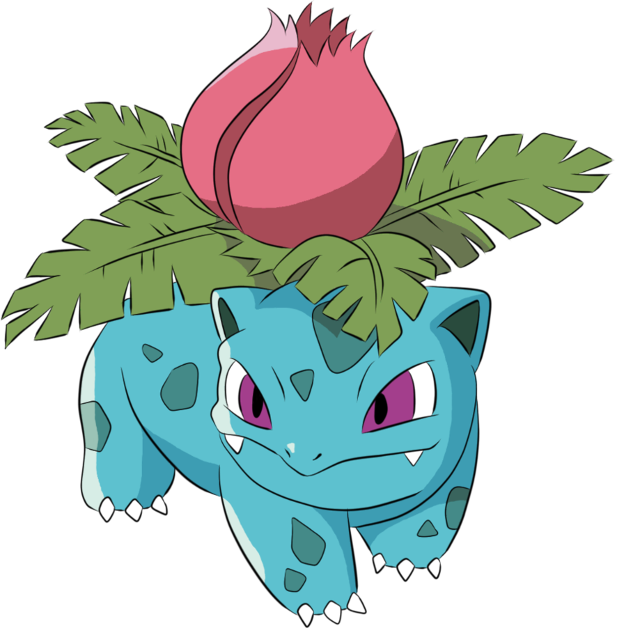

````html

<li class="pokemon">
        <span class="number">#002</span>
        <span class="name">Ivysau</span>

        <div class="detail">

          <ol class="types">
            <li class="type">Grass</li>
            <li class="type">Poison</li>
          </ol>
        
        
        </div>
      </li>


      <li class="pokemon">
        <span class="number">#003</span>
        <span class="name">Venusaur</span>

        <div class="detail">

          <ol class="types">
            <li class="type">Grass</li>
            <li class="type">Poison</li>
          </ol>
        
          
        </div>  
      </li>

      <li class="pokemon">
        <span class="number">#004</span>
        <span class="name">Charmander</span>

        <div class="detail">

          <ol class="types">
            <li class="type">Fire</li>
          </ol>
        
        
        </div>
      </li>

      <li class="pokemon">
        <span class="number">#005</span>
        <span class="name">Charmeleon</span>

        <div class="detail">

          <ol class="types">
            <li class="type">Fire</li>
          </ol>
        
        
        </div>
      </li>

      <li class="pokemon">
        <span class="number">#006</span>
        <span class="name">Charizard</span>

        <div class="detail">

          <ol class="types">
            <li class="type">Fire</li>
          </ol>
        
        
        </div>
      </li>````
